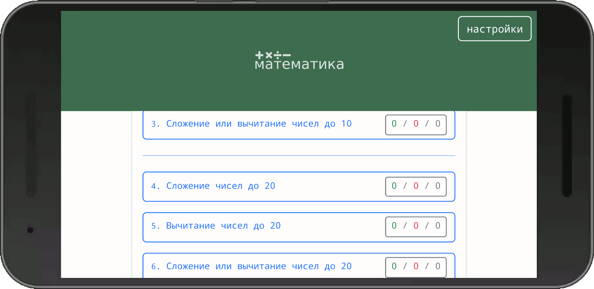
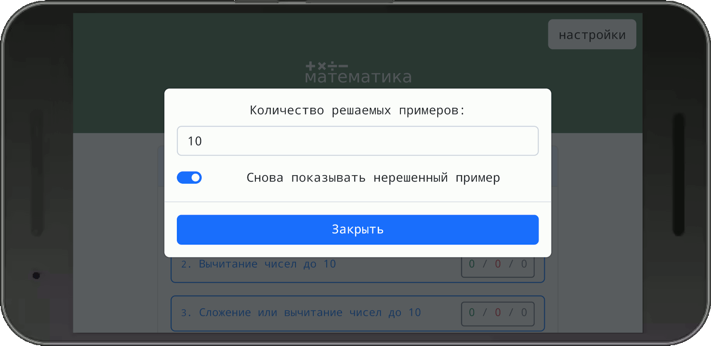
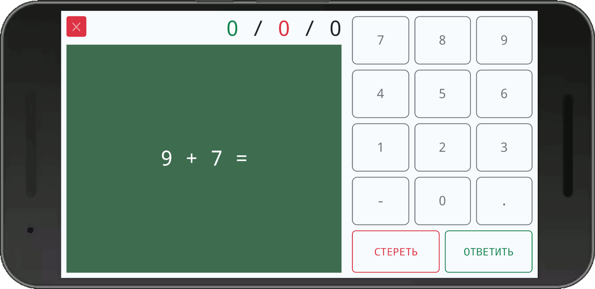
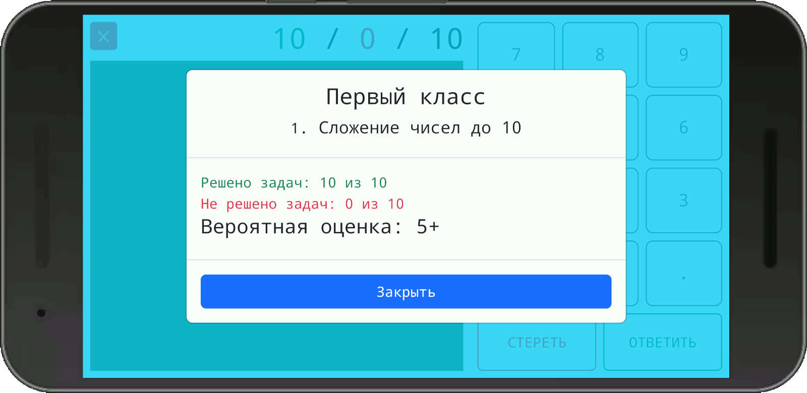

# happy-math

#### Разные задачи:

#### Настройки:

#### Пример примера))):

#### Результат:

### Живой пример:
[wareset.github.io/rease-example-happy-math/app/mathematica.html](https://wareset.github.io/rease-example-happy-math/app/mathematica.html)
